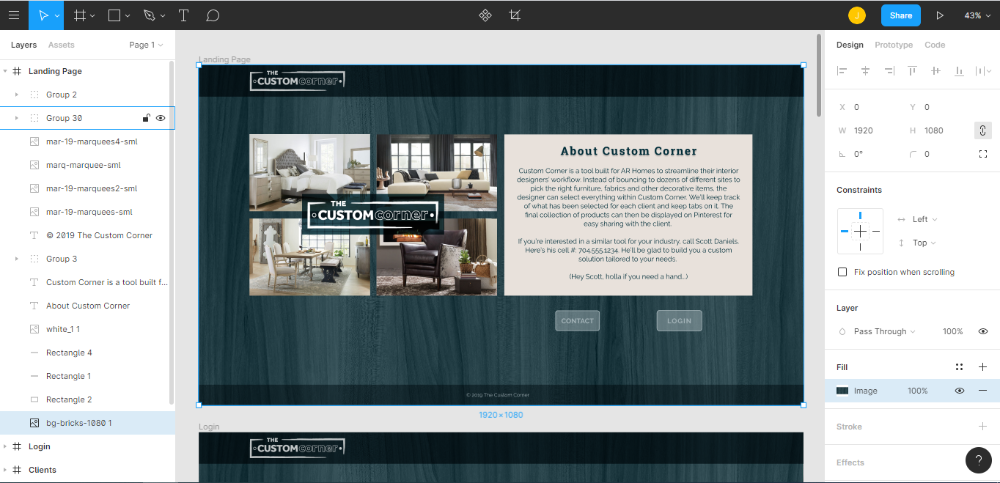

# The Custom Corner

Full Stack Web Development - Project 3
Site Location - [custom-corner.com](https://custom-corner.com)

## Purpose
This purpose of this site is to give interior designers the ability to search the inventory of multiple vendors from one page - giving them a single pane of glass experience.  This allows the user to not have to search multiple websites when looking for the perfect piece of furniture for their client.

## New Technologies
For one of the vendors, we are utilizing python to complete the web scraping.  Python is making use of the following modules:
- requests
- bs4
- pymongo

Requests is an http request library similar to that of Axios/AJAX in Javascript.  BS4 (otherwise known as BeautifulSoup) is an HTML/XML parsing library similar to the cheerio module in JavaScript.  Finally, pymongo is the mongodb driver for python, allowing us to add records to the database.

Aside from python, we also made use of an additional library we didn't discuss in class - Puppetteer - a JavaScript library that assists with web page scraping by emulating user clicks on pages that reject conventional scrapes.

For our design scheme, we used Figma.

## Hosting

The site has been hosted on Google Cloud, and is currently utilizing Docker to run the infrastructure of the web application.  There are 5 different containers running on the server:
- Mongo (Houses the database of the application.)
- NGINX (Performs reverse proxy, and handles SSL.  It also redirects traditional http connections to https)
- Certbot (Automates keeping SSL Cert with LetsEncrypt Valid.)
- Alpine (Small Linux container that's responsible for running the scraping scripts.)
- Node (Runs the react-app.)

## Group Members

* Scott Daniels
* Greg Desmarais
* Jeff Greco
* Bradley Cordle
* Toney Higgins
* Jarkko Haarla